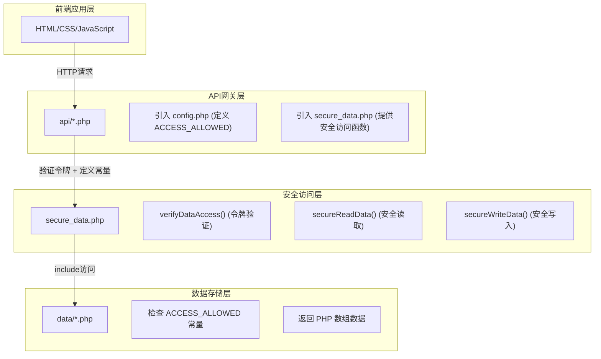

# 开发指导 · PonyConsanguinity

> 本文档汇总**万驹同源服务器官网**的技术细节、安全配置与 AI 体系原理，面向开发者。
> 项目概览请看 [README.md](README.md)；全部配置说明请看 [CONFIGURATION.md](CONFIGURATION.md)。

## 目录

1. [UI 组件](#一ui-组件)
2. [画廊图片添加方法](#二画廊图片添加方法)
3. [页面模板使用](#三页面模板使用)
4. [论坛分类标签配置](#四论坛分类标签配置)
5. [安全配置](#五安全配置)
6. [AI 客服系统](#六ai-客服系统)
7. [AI Agent 远程框架](#七ai-agent-远程框架)

---

## 一、UI 组件

### 概述

项目提供了多个可复用的UI组件，方便在不同页面中快速集成常用功能。

### 组件列表

#### 侧边栏音乐播放器

##### 概述

音乐播放器是网站的一个核心组件，位于页面右侧边栏，提供音乐播放、进度控制、音量调节等功能。

##### 文件结构

```PC_Web/
├── components/
│   └── sidebar-player.html # 音乐播放器组件
├── css/
│   └── sidebar-player.css # 音乐播放器样式
└── js/
    └── sidebar-player.js # 音乐播放器脚本
```

##### 核心功能

1.  **音乐播放控制**：播放/暂停、上一曲/下一曲
2.  **进度控制**：进度条显示和点击调整
3.  **音量调节**：音量滑块控制
4.  **歌曲信息显示**：歌曲标题
5.  **播放列表**：多首歌曲切换

##### 组件集成

在页面中集成音乐播放器组件：
```html
<!-- 音乐播放器 -->
<div id="app-sidebar-player"></div>
<script src="js/sidebar-player.js?v=3.0"></script>
```

同时，在body标签中添加对应的组件配置：
```html
<body data-components="sidebarPlayer,backToTop,navbar,footer">
```

##### 添加新歌曲

1.  **添加音乐文件**：将音乐文件上传到 `assets/music/` 目录
2.  **修改播放器组件**：编辑 `components/sidebar-player.html` 文件，在播放列表中添加新歌曲信息：
    ```html
     <!-- 示例：添加新歌曲 -->
     <div class="song-item" data-src="../assets/music/NewSong.mp3" data-title="新歌曲" data-artist="艺术家">
         <div class="song-title">新歌曲</div>
         <div class="song-artist">艺术家</div>
     </div>
    ```

#### 返回顶部按钮

**功能**：当页面滚动到一定位置时显示，点击可快速返回页面顶部。

**文件位置**：

-   样式文件：`css/back-to-top.css`
-   脚本文件：`js/back-to-top.js`

**使用方式**：

1.  在HTML中引入样式和脚本：
    ```html
     <link rel="stylesheet" href="../css/back-to-top.css?v=1.0">
     <script src="../js/back-to-top.js?v=1.0"></script>
    ```
2.  在body标签中添加组件标识：
    ```html
     <body data-components="sidebarPlayer,backToTop,navbar,footer">
    ```

**自定义配置**：可以在 `js/back-to-top.js` 中修改以下配置：
```javascript
const config = {
    showOffset: 300, // 滚动多少像素后显示按钮
    scrollSpeed: 500 // 返回顶部的滚动速度（毫秒）
};
```

#### 浮动按钮

**功能**：提供快捷操作的浮动按钮，如"创建帖子"、"返回论坛"等。

**实现方式**：使用CSS固定定位实现：
```css
.floating-button {
    position: fixed;
    right: 20px;
    bottom: 90px;
    z-index: 999;
    /* 其他样式 */
}
```

**使用场景**：

-   论坛页面的"创建帖子"按钮
-   公告详情页的"返回论坛"按钮
-   帖子详情页的"滚动到回复"按钮

#### 导航栏

**功能**：网站主导航，提供页面间的快速跳转。

**使用方式**：在body标签中添加组件标识：
```html
<body data-components="sidebarPlayer,backToTop,navbar,footer">
```

#### 页脚

**功能**：网站页脚，包含版权信息和链接。

**使用方式**：在body标签中添加组件标识：
```html
<body data-components="sidebarPlayer,backToTop,navbar,footer">
```

### 组件加载机制

项目使用自动组件加载机制，根据 `body` 标签的 `data-components` 属性自动加载对应的组件。

**示例**：
```html
<body data-components="sidebarPlayer,backToTop,navbar,footer">
```

这会自动加载以下组件：

-   sidebarPlayer：侧边栏播放器
-   backToTop：返回顶部按钮
-   navbar：导航栏
-   footer：页脚

### 注意事项

-   确保组件的CSS和JS文件正确引入
-   组件ID必须与脚本中的选择器匹配
-   组件加载顺序可能影响功能，请按正确顺序引入

---

## 二、画廊图片添加方法

### 概述

本项目首页包含一个图片画廊，用于展示服务器风采。添加新图片需要修改两个文件：`index.html` 和 `css/style.css`。

### 步骤1：在index.html中添加图片

在 `gallery-track` 中，你需要添加两次图片（第一组和第二组，用于无缝循环）：

**第一组位置**：在第254行之前添加
```html
<div class="gallery-item" data-title="图片标题" data-description="图片描述">
    
    <div class="gallery-item-overlay">
        <div class="gallery-item-description">图片描述</div>
    </div>
</div>
```

**第二组位置**：在第339行之前添加（复制第一组的代码）

### 步骤2：在css/style.css中更新动画距离

每添加一张图片，需要更新 `@keyframes scroll` 中的移动距离：

-   每张图片宽度：300px
-   左右边距：15px × 2 = 30px
-   单张图片总宽度：330px
-   动画移动距离 = 图片总数 × 330px

例如：

-   14张图片：4620px
-   15张图片：4950px
-   16张图片：5280px

在 `css/style.css` 的 `@keyframes scroll` 中修改：
```css
100% {
    transform: translateX(-4620px);
}
```

---

## 三、页面模板使用

### 概述

本项目提供了统一的页面模板，用于创建符合网站风格的新页面，避免重复代码。所有页面都应遵循此模板结构。

### 文件位置

模板文件位于：`templates/page-template.html`

### 使用方法

1.  复制 `templates/page-template.html` 到 `pages/` 目录
2.  重命名为合适的文件名，如 `new-page.html`
3.  根据需要修改内容

### 模板结构说明

#### 1. CSS样式引入

```html
<!-- ========== CSS样式文件引入 ========== -->
<link rel="stylesheet" href="../css/style.css?v=3.22">
<link rel="stylesheet" href="../css/sidebar-player.css?v=2.0">
<link rel="stylesheet" href="../css/back-to-top.css?v=1.0">
```

#### 2. 组件配置

```html
<!-- ========== body标签中的data-components属性 ========== -->
<!-- 可用组件：sidebarPlayer, backToTop, navbar, footer -->
<body data-components="sidebarPlayer,backToTop,navbar,footer">
```

根据页面需要，可以移除不需要的组件。

#### 3. Banner区域（可选）

如果页面需要Banner，使用以下代码，并添加 `common-banner` 类以确保统一的高度和布局：
```html
<!-- ========== Banner区域（可选） ========== -->
<section class="subpage-banner common-banner">
    <div class="subpage-banner-bg"></div>
    <div class="subpage-banner-particles"></div>
    <div class="container">
        <div class="subpage-banner-content">
            <h1 class="subpage-banner-title">页面标题</h1>
            <p class="subpage-banner-subtitle">副标题描述</p>
        </div>
    </div>
</section>
```

#### 4. 公共Banner类说明

本项目使用 `common-banner` 类来统一所有子页面的Banner样式：

-   **适用范围**：所有子页面（论坛、状态页、皮肤站等），不包括首页
-   **统一高度**：默认最小高度为350px
-   **布局方式**：使用Flex布局居中内容
-   **响应式设计**：使用min-height确保灵活性

**使用示例**：
```html
<!-- 论坛页面Banner -->
<section class="forum-banner common-banner">
    <!-- 内容 -->
</section>

<!-- 状态页面Banner -->
<section class="status-banner common-banner">
    <!-- 内容 -->
</section>

<!-- 皮肤站页面Banner -->
<section class="skin-header common-banner">
    <!-- 内容 -->
</section>
```

**注意**：首页使用独立的 `hero-banner` 类，高度为650px，不受此公共类影响。

#### 5. 主要内容区域

```html
<!-- ========== 主要内容区域 ========== -->
<div class="section">
    <div class="container">
        <!-- 在这里添加页面主要内容 -->
        <!-- 示例：卡片布局 -->
        <div class="card fade-in">
            <div class="card-header">
                <h2>卡片标题</h2>
            </div>
            <div class="card-body">
                <p>卡片内容...</p>
            </div>
        </div>
    </div>
</div>
```

#### 6. JavaScript脚本引入

**注意：引入顺序很重要，必须按照以下顺序**
```html
<!-- 1. API工具库（如果需要） -->
<script src="../js/api.js"></script>

<!-- 2. 主脚本（包含常用函数） -->
<script src="../js/main.js?v=3.5"></script>

<!-- 3. 回到顶部脚本 -->
<script src="../js/back-to-top.js?v=1.0"></script>

<!-- 4. 导航栏脚本 -->
<script src="../js/navbar.js?v=1.0"></script>

<!-- 5. 音乐播放器脚本 -->
<script src="../js/sidebar-player.js?v=3.0"></script>

<!-- 6. 组件加载器 -->
<script src="../components/loader.js?v=3.0"></script>
```

### 常用组件说明

#### 卡片组件

```html
<div class="card fade-in">
    <div class="card-header">
        <h2>卡片标题</h2>
    </div>
    <div class="card-body">
        <p>卡片内容...</p>
    </div>
</div>
```

#### 动画效果

-   `fade-in`：淡入效果
-   `fade-in-delay-1`：延迟淡入（1级延迟）
-   `fade-in-delay-2`：延迟淡入（2级延迟）
-   以此类推...

#### 按钮样式

```html
<!-- 主要按钮 -->
<button class="btn btn-primary">按钮文本</button>

<!-- 次要按钮 -->
<button class="btn btn-outline">按钮文本</button>

<!-- 小按钮 -->
<button class="btn btn-sm btn-primary">小按钮</button>
```

### 常见页面类型示例

#### 1. 简单信息页

```html
<div class="section">
    <div class="container">
        <div class="card fade-in">
            <div class="card-header">
                <h2>页面标题</h2>
            </div>
            <div class="card-body">
                <p>页面内容...</p>
            </div>
        </div>
    </div>
</div>
```

#### 2. 列表页（如公告页）

```html
<div class="section announcement-page">
    <div class="container">
        <div class="announcement-list">
            <!-- 列表项 -->
            <div class="announcement-item fade-in">
                <div class="announcement-header">
                    <h2 class="announcement-title">标题</h2>
                    <div class="announcement-meta">
                        <span class="announcement-type update">类型</span>
                        <span class="announcement-date">日期</span>
                    </div>
                </div>
                <div class="announcement-content">
                    <p>内容...</p>
                </div>
                <div class="announcement-actions">
                    <a href="#" class="announcement-link">查看详情 →</a>
                </div>
            </div>
        </div>
    </div>
</div>
```

#### 3. 表单页

```html
<div class="section">
    <div class="container">
        <div class="card fade-in">
            <div class="card-header">
                <h2>表单标题</h2>
            </div>
            <div class="card-body">
                <form>
                    <div class="form-group">
                        <label>标签</label>
                        <input type="text" placeholder="请输入内容">
                    </div>
                    <div class="form-group">
                        <label>标签</label>
                        <textarea rows="5" placeholder="请输入内容"></textarea>
                    </div>
                    <button type="submit" class="btn btn-primary">提交</button>
                </form>
            </div>
        </div>
    </div>
</div>
```

### 注意事项

1.  **路径问题**：确保CSS和JS文件的路径正确（通常使用`../`返回上一级目录）
2.  **版本号**：在CSS和JS文件名后添加版本号（如`?v=3.22`）以避免缓存问题
3.  **响应式设计**：使用已有的CSS类确保页面在不同设备上正常显示
4.  **组件顺序**：严格按照模板中的顺序引入JavaScript文件
5.  **动画效果**：合理使用动画效果，避免过度使用

---

## 四、论坛分类标签配置

### 功能说明

论坛系统支持帖子分类功能，开发者可以添加新的分类标签来组织帖子内容。

### 配置步骤

#### 步骤1：在forum.html中添加分类标签

在容器中添加新的分类按钮：
```html
<div class="tabs fade-in">
    <button class="tab active" data-tab="all">全部</button>
    <button class="tab" data-tab="general">综合讨论</button>
    <button class="tab" data-tab="guide">攻略分享</button>
    <button class="tab" data-tab="report">举报反馈</button>
    <!-- 添加新分类 -->
    <button class="tab" data-tab="new-category">新分类</button>
</div>
```

#### 步骤2：在forum.html中更新JavaScript分类处理

在论坛页面的JavaScript中更新分类处理逻辑：
```javascript
// 分类名称映射
function getCategoryName(category) {
    const categoryNames = {
        'all': '全部',
        'general': '综合讨论',
        'guide': '攻略分享',
        'report': '举报反馈',
        'new-category': '新分类名称'
    };
    return categoryNames[category] || category;
}

// 分类颜色映射
function getCategoryColor(category) {
    const categoryColors = {
        'general': '#3498db',
        'guide': '#2ecc71',
        'report': '#e74c3c',
        'new-category': '#新分类颜色'
    };
    return categoryColors[category] || '#95a5a6';
}
```

#### 步骤3：在posts.php中更新帖子数据

在帖子数据中添加新分类的帖子示例：
```php
[
    {
        'id' => 'post-id',
        'title' => '帖子标题',
        'author' => '作者名',
        'created_at' => '2026-02-22 10:00:00',
        'views' => 0,
        'forum' => 'new-category',
        'content_file' => 'post-content.md'
    }
]
```

### 注意事项

-   分类标识符（data-tab属性）必须唯一
-   建议使用小写字母和连字符命名
-   分类颜色建议使用十六进制颜色代码
-   确保JavaScript中的分类映射包含新分类
-   帖子数据中的forum字段值必须与分类标识符一致
-   所有分类标签使用统一样式，无需单独配置CSS

---

## 五、安全配置

### 概述

本项目包含敏感数据（用户信息、帖子内容等），必须采取适当的安全措施来保护这些数据。

### 核心安全机制

本项目实施了全面的数据系统安全性增强措施，通过多层防护机制保护敏感数据，防止未授权访问和数据泄露。

#### 1. PHP文件包装机制

**原理**：将部分数据从JSON文件转换为PHP文件，利用PHP的访问控制特性防止直接HTTP访问。

**实现方式**：

-   原始JSON文件（如`users.json`）转换为`users.php`
-   PHP文件头部添加访问控制检查
-   数据以PHP数组形式存储，通过`include`语句读取

**示例代码(旧)**（users.php）：
```php
<?php
if (!defined('ACCESS_ALLOWED')) {
    header('HTTP/1.1 403 Forbidden');
    exit;
}
return [
    'GoldenApplePie' => [
        'id' => 'c361cebb-3a36-4799-b094-46bc1d81f0f5',
        'username' => 'GoldenApplePie',
        'password' => 'gap12345',
        'email' => 'czhdqqyx6044@qq.com',
        'created_at' => '2026-01-26 09:35:23',
        'role' => 'admin'
    ],
];
?>
```

**安全效果**：

-   直接访问`/data/users.php`会返回403 Forbidden
-   只有定义了`ACCESS_ALLOWED`常量的PHP脚本才能读取数据
-   防止了通过浏览器直接查看敏感数据的风险

#### 2. 访问控制常量

**常量定义**：在`api/config.php`中定义全局访问控制常量。
```php
// 定义访问常量
define('ACCESS_ALLOWED', true);
```

**使用方式**：

-   所有需要访问敏感数据的API文件必须先引入`config.php`
-   引入后自动定义`ACCESS_ALLOWED`常量
-   数据文件检查此常量是否存在

**安全流程**：
```API请求 → 引入config.php → 定义ACCESS_ALLOWED → 访问数据文件 → 验证常量 → 允许访问
```

#### 3. 安全数据访问函数

**函数定义**：在`api/secure_data.php`中提供统一的数据访问接口。

**核心函数**：

##### verifyDataAccess()

```php
function verifyDataAccess($requireToken = true) {
    if (!$requireToken) {
        return;
    }
    $token = $_GET['token'] ?? $_SERVER['HTTP_X_DATA_TOKEN'] ?? '';
    if ($token !== DATA_ACCESS_TOKEN) {
        header('HTTP/1.1 403 Forbidden');
        exit;
    }
}
```

**功能**：

-   验证数据访问令牌
-   可配置是否强制要求令牌验证

##### 令牌安全建议

⚠️ **重要**：`DATA_ACCESS_TOKEN` 是系统的重要安全组件，请务必：

1.  **修改默认令牌**：将 `api/secure_data.php` 中的默认值 `your-secret-token-here` 替换为强随机值
2.  **使用强令牌**：使用尽量长的随机字符串，包含大小写字母、数字和特殊字符
3.  **定期更换**：定期更新令牌值，保障系统安全性
4.  **妥善保管**：不要将令牌提交到代码仓库或分享给未授权人员
5.  **访问控制**：只在必要的操作中使用 `requireToken = true`，避免过度使用

**生成强令牌的方法**：
```bash
# 使用PHP生成
php -r "echo bin2hex(random_bytes(32));"
```

**示例强令牌**：
```8f42a73e6b9f4c8d9e2a3b4c5d6e7f8a9b0c1d2e3f4a5b6c7d8e9f0a1b2c3d4e
```

##### 令牌验证测试

为了验证数据访问令牌的功能，项目提供了测试脚本，位于 `test/` 目录：

**测试脚本**：

-   `test/test_token.php` - 命令行测试脚本
-   `test/test_token_api.php` - API端点测试脚本

**使用方法**：

1.  **启动本地服务器**：
    ```bash
     php -S localhost:8000
    ```
2.  **测试不提供令牌**：
    ```powershell
     Invoke-WebRequest -Uri "http://localhost:8000/test/test_token_api.php" -UseBasicParsing
     # 预期结果：403 Forbidden
    ```
3.  **测试提供正确的令牌**：
    ```powershell
     Invoke-WebRequest -Uri "http://localhost:8000/test/test_token_api.php?token=YOUR_TOKEN_HERE" -UseBasicParsing
     # 预期结果：200 OK，返回成功信息
    ```
4.  **测试提供错误的令牌**：
    ```powershell
     Invoke-WebRequest -Uri "http://localhost:8000/test/test_token_api.php?token=wrong-token" -UseBasicParsing
     # 预期结果：403 Forbidden
    ```
5.  **测试不需要令牌的接口**：
    ```powershell
     Invoke-WebRequest -Uri "http://localhost:8000/test/test_token_api.php?action=public"-UseBasicParsing
     # 预期结果：200 OK，返回成功信息
    ```

**注意**：将 `YOUR_TOKEN_HERE` 替换为你在 `api/secure_data.php` 中设置的实际令牌值。

##### secureReadData()

```php
function secureReadData($file, $requireToken = false) {
    verifyDataAccess($requireToken);
    if (file_exists($file)) {
        return include $file;
    }
    return [];
}
```

**功能**：

-   安全读取数据文件
-   自动进行令牌验证（可选）
-   使用`include`语句读取PHP文件
-   文件不存在时返回空数组

##### secureWriteData()

```php
function secureWriteData($file, $data, $requireToken = false) {
    verifyDataAccess($requireToken);
    $dir = dirname($file);
    if (!file_exists($dir)) {
        mkdir($dir, 0755, true);
    }
    // 对于 PHP 文件，使用 include 格式写入
    $content = "<?php\n";
    $content .= "if (!defined('ACCESS_ALLOWED')) {\n";
    $content .= "    header('HTTP/1.1 403 Forbidden');\n";
    $content .= "    exit;\n";
    $content .= "}\n\n";
    $content .= "return " . var_export($data, true) . ";\n";
    $content .= "?>";

    file_put_contents($file, $content);
}
```

**功能**：

-   安全写入数据文件
-   自动创建目录（如果不存在）
-   自动添加访问控制头部
-   使用`var_export()`确保数据格式正确

**使用示例**：
```php
// 读取用户数据
$users = secureReadData(USERS_FILE);

// 写入会话数据
$sessions[$token] = $userData;
secureWriteData(SESSIONS_FILE, $sessions);
```

#### 4. 目录保护

**保护机制**：在`data/`目录下创建`index.php`文件。

**实现代码**：
```php
<?php
header('HTTP/1.1 403 Forbidden');
header('Status: 403 Forbidden');
echo 'Access Denied';
exit;
```

**安全效果**：

-   防止目录列表泄露
-   访问`/data/`返回403错误
-   保护目录结构信息

#### 5. 会话管理

**FIFO会话清理**：系统实现了先进先出（FIFO）的会话清理机制。

**配置**：
```php
// 会话配置
define('MAX_SESSIONS', 10);
```

**工作原理**：

-   每次用户登录时，系统会检查当前会话数量
-   如果会话数量达到或超过`MAX_SESSIONS`，系统会删除最旧的会话
-   然后添加新的会话，始终保持会话数量不超过限制

#### 6. API模式配置

**配置文件**：`js/api.js`

**关键设置**：
```javascript
// 强制使用真实API模式
USE_MOCK_MODE = false;
console.log('使用真实 API 模式，因为系统中已安装 PHP');
```

**功能说明**：

-   `USE_MOCK_MODE = false`：使用真实PHP API
-   `USE_MOCK_MODE = true`：使用模拟数据（开发测试用）
-   系统会自动检测API可用性

**API请求流程**：
```前端请求 → api.js → 检查USE_MOCK_MODE →
真实API: 发送到PHP后端 → secureReadData() → 读取数据 → 返回结果
Mock模式: 返回模拟数据 → 直接返回结果
```

### 数据文件结构

#### 转换后的PHP文件

| 原始文件 | 转换后文件 | 用途 |
| --------------- | -------------- | ---------------- |
| `users.json` | `users.php` | 用户数据（用户名、密码、邮箱等） |
| `sessions.json` | `sessions.php` | 会话数据（登录令牌、用户信息） |
| `posts.json` | `posts.php` | 帖子数据（帖子列表、内容） |

#### 保留的JSON文件

| 文件 | 用途 | 安全措施 |
| ------------------------------------ | ------ | ------------ |
| `notifications.json` | 系统通知 | 通过API访问，目录保护 |
| `user_notifications/{username}.json` | 用户已读通知 | 通过API访问，目录保护 |
| `replies/{post_id}.json` | 帖子回复 | 通过API访问，目录保护 |
| `content/{timestamp}.md` | 帖子内容 | 通过API访问，目录保护 |

### 安全架构图



### 安全测试

#### 测试用例

**测试1：直接访问数据文件**
```bash
# 预期结果：403 Forbidden
curl http://localhost:8000/data/users.php
```

**测试2：通过API访问数据**
```bash
# 预期结果：成功返回数据
curl -H "Authorization: Bearer {token}" \
     http://localhost:8000/api/notification.php?action=list
```

**测试3：目录列表保护**
```bash
# 预期结果：403 Forbidden
curl http://localhost:8000/data/
```

**测试4：通知功能测试**
```bash
# 预期结果：成功返回通知列表
curl -H "Authorization: Bearer {token}" \
     http://localhost:8000/api/notification.php?action=list
```

### 安全优势

1.  **多层防护**：PHP文件包装 + 访问控制常量 + 令牌验证
2.  **最小权限原则**：只有定义了常量的API才能访问数据
3.  **防止直接访问**：所有敏感文件都无法通过HTTP直接访问
4.  **统一接口**：通过`secure_data.php`提供统一的数据访问接口
5.  **灵活配置**：可配置是否强制要求令牌验证
6.  **易于维护**：代码结构清晰，便于后续扩展

### 认证系统安全增强

#### 概述

项目对注册登录系统进行了全面的安全加强，实现了现代 Web 应用的安全标准。

#### 安全特性

##### 1. 密码安全存储

**技术**：使用 PHP `password_hash()` 函数（bcrypt 算法）

**实现**：

-   用户密码使用 bcrypt 算法哈希存储
-   自动处理盐值，每次哈希结果不同
-   使用 `password_verify()` 验证密码

**安全效果**：

-   即使数据库泄露，攻击者也无法直接获取明文密码
-   彩虹表攻击无效
-   符合现代安全标准

##### 2. 登录失败限制

**机制**：账户锁定策略

**配置**：

-   最大尝试次数：5 次
-   锁定时间：15 分钟

**实现**：
```php
// 验证密码
if (!password_verify($password, $user['password'])) {
    // 记录失败次数
    $users[$username]['login_attempts'] = ($users[$username]['login_attempts'] ?? 0) + 1;

    // 超过5次锁定15分钟
    if ($users[$username]['login_attempts'] >= 5) {
        $users[$username]['lock_until'] = date('Y-m-d H:i:s', time() + 900);
    }
}
```

**安全效果**：

-   防止暴力破解攻击
-   防止字典攻击
-   保护弱密码用户

##### 3. 密码复杂度要求

**规则**：

-   最小长度：8 位
-   必须包含：大写字母、小写字母、数字
-   可选：特殊字符

**实现**：
```php
if (strlen($password) < 8) {
    return '密码长度至少为8位';
}
if (!preg_match('/[A-Z]/', $password)) {
    return '密码必须包含大写字母';
}
if (!preg_match('/[a-z]/', $password)) {
    return '密码必须包含小写字母';
}
if (!preg_match('/[0-9]/', $password)) {
    return '密码必须包含数字';
}
```

**安全效果**：

-   提高密码强度
-   减少被猜测风险

##### 4. 安全日志系统

**功能**：记录所有认证相关事件

**日志内容**：

-   登录成功/失败
-   用户注册
-   用户注销
-   账户删除
-   账户锁定
-   安全告警

**日志信息**：

-   时间戳
-   IP 地址
-   设备信息（浏览器、操作系统）
-   事件详情

**日志文件**：`logs/security/auth_YYYYMMDD.log`

**示例日志**：
```[2026-03-01 10:30:15] [info] [登录成功] 用户: xxx | 角色: admin | IP: 127.0.0.1 | 设备: Chrome/Windows/Desktop
[2026-03-01 10:31:20] [warning] [登录失败] 用户: xxx | IP: 127.0.0.1 | 原因: 密码错误 | 设备: Chrome/Windows
[2026-03-01 10:32:00] [error] [账户锁定] 用户: xxx | IP: 127.0.0.1 | 原因: 连续登录失败 5 次
```

**安全效果**：

-   审计追踪
-   异常检测
-   安全分析

##### 5. 异常登录检测

**检测项**：

-   频繁登录失败（1小时内超过3次）
-   IP 地址变化

**实现**：
```php
// 检测频繁登录失败
if ($recentFailures >= 3) {
    $this->logSecurityAlert($username, '频繁登录失败', [
        'failures_in_hour' => $recentFailures
    ]);
}

// 检测IP变化
if ($lastSuccess['ip'] !== $currentIP) {
    $this->logSecurityAlert($username, 'IP地址变化', [
        'previous_ip' => $lastSuccess['ip'],
        'current_ip' => $currentIP
    ]);
}
```

**安全效果**：

-   及时发现可疑登录
-   预警潜在攻击

---

## 六、AI 客服系统

万驹同源 AI 体系包含**两个独立人格**——**客服 AI**（面向普通玩家，只读）与**管理 AI 助手**（面向管理员，全量），共享底层模型引擎但权限完全隔离。

### 访问方式

- **客服 AI**：`pages/ai/kefu.html`（个人中心左下角客服按钮也可进入）
- **管理 AI 助手**：`tools/admin-hub.html#/ai`（管理员后台侧栏「AI 助手」标签页）

### 双 Persona（人格隔离）

| 属性 | 客服 AI（customer） | 管理 AI 助手（admin） |
|------|---------------------|---------------------|
| prompt 文件 | `prompt_customer.md` | `prompt_admin.md` |
| 知识库文件 | `knowledge_base.md`（面向玩家） | `knowledge_base_admin.md`（运维知识） |
| MCP 工具 | **仅 5 只读**（服务端强制白名单） | **全部 32 个**（写操作仍需管理员登录） |
| 安全层 | 前端白名单 + 服务端强制 customer persona + 写操作拒绝 | 管理员会话鉴权 |
| 所在页面 | `kefu.html` | `admin-hub.html#/ai` |

**关键安全设计**：客服的 MCP 请求走专用入口 `api/ai/mcp-customer.php`，服务端通过 `MCP_PERSONA_FORCED='customer'` 常量强制只放行 `allowed_tools` 白名单（5 个只读工具）。简单来说，**即使管理员登录客服页也无法执行写操作**。

### MCP（模型上下文协议）集成

#### 什么是 MCP？

**MCP（Model Context Protocol）** 是一种标准化的协议，为 AI 模型提供访问外部数据源和服务的能力。本项目基于 MCSManager 的 API 打造了一套完整的 MCP 体系，涵盖 32 个 JSON-RPC 2.0 工具（注册于 `mcp/tools/*.php`，glob 自动发现）：

**读取类（客服可访问 5 个）：**
`get_dashboard` · `list_instances` · `get_instance_detail` · `list_announcements` · `get_announcement`

**写入类（仅管理员）：**
`get_instance_log` · `start_instance` · `stop_instance` · `restart_instance` · `send_command` · `write_announcement` · `send_notification` 等 27 个（含文件管理、爱发电订单查询/处理、玩家查询等）

#### MCP 入口

| 入口 | 角色 | 工具范围 | 鉴权方式 |
|------|------|---------|---------|
| `mcp/mcp-server.php` | 管理通道（默认 admin） | 全部 32 个 | 管理员会话 |
| `api/ai/mcp-customer.php` | 客服通道（强制 customer） | 仅 5 只读 | 服务端硬编码白名单，不可绕过 |

#### 工具调用流程

LLM 的回复中包含 `TOOL_CALL:{"name":"工具名","arguments":{...}}` 标记 → 前端解析后调用 `safeCallTool()`（客服）/ `McpClient.callTool()`（管理）→ 结果回喂给 LLM 归纳 → 最多 4 轮循环。

> ⚠️ **解析硬规则**：前端解析 `TOOL_CALL:{...}` JSON 时必须使用**平衡花括号扫描**（字符串字面量跳过），禁止用正则 `\{[\s\S]*\}`（贪婪会跨抓相邻调用、非贪婪会在嵌套 dict 处截断，导致 JSON.parse 失败、工具静默不执行）。`extractNextToolCall()` / `extractJsonObject()` 已内置此逻辑。

### 知识库（RAG）

#### 核心原理

**RAG（Retrieval-Augmented Generation，检索增强生成）**：用户提问时，`KnowledgeBase` 类从 `knowledge_base.md` 中按关键词匹配相关条目，组装为 `【知识库内容】` 追加到 system prompt 中，使 AI 的回答更准确、更有针对性。

#### 文件结构

| 文件 | 用途 |
|------|------|
| `api/ai/knowledge_base.md` | 面向玩家的客服知识库（服务器信息、IP、Mod 列表等） |
| `api/ai/knowledge_base_admin.md` | 面向管理员的运维知识库（排障指南、面板操作等） |

### 统一后端代理（全链路）

前端统一通过 PHP 代理 `api/ai/api.php` 调用 LLM（不再区分本地/生产直连），API Key 只在服务端 `config.php` 中配置，不暴露到前端：

| 环境 | 路径 | API Key 来源 |
|------|------|-------------|
| 本地开发（localhost / 127.0.0.1） | PHP 代理（`api/ai/api.php`） | 服务端 `config.php` |
| 生产环境 | PHP 代理（`api/ai/api.php`） | 服务端 `config.php`，不暴露到前端 |

> AI 大模型的具体配置项（`ECHO_API_URL` / `DEEPSEEK_*` / `EYPA_AI_MODELS` / `AI_PERSONAS`）见 [CONFIGURATION.md](CONFIGURATION.md) 的「AI 大模型配置」章节。

---

## 七、AI Agent 远程框架

在站内「AI 客服系统」与「管理员后台 AI 助手」之外，本项目还提供一套**面向外部客户端的远程 Agent 框架**：网站后端作为 MCP Server，任何支持 Streamable HTTP MCP 的客户端（标准 MCP Host、APP 等）均可通过 Service Key 鉴权远程接入，复用同一套工具基底。

### 三个 MCP 入口

| 入口 | 角色 / 鉴权 | 工具范围 | 适用方 |
|------|------------|---------|--------|
| `mcp/mcp-server.php` | 站内管理通道（管理员会话） | 全部 32 个 | 网站后台 `admin-hub.html` |
| `api/ai/mcp-customer.php` | 客服通道（服务端强制 `customer` persona） | 仅 5 只读 | 网站 `kefu.html` |
| `mcp/remote.php` | **远程通道（Service Key / SHA256 鉴权）** | 按 Key 角色映射（admin / user） | 外部 Client（Godot APP、WorkBuddy 等） |

### 远程端点 mcp/remote.php

- **传输协议**：Streamable HTTP（请求-响应模式），协议版本 `2025-03-26`，JSON-RPC 2.0。
- **鉴权**：客户端在 `Authorization: Bearer <明文 Key>` 头携带 Service Key；服务端对其做 `hash('sha256', $key)`，查 `config.php` 的 `MCP_SERVICE_KEYS`（`hash => 角色`）映射。
  - 无有效 Key 的请求角色为 `guest`，`tools/list` / `tools/call` 直接返回 `-32001` 鉴权失败。
- **新增 Key**：生成明文 Key → `hash('sha256', $key)` → 将 `hash => 角色` 追加进 `config.php` 的 `MCP_SERVICE_KEYS` 数组即可，无需改动端点代码。

**明文 Key 与 `config.php` 中哈希的对应关系**（重要，请勿混淆）：

`config.php` 的 `MCP_SERVICE_KEYS` 里存的是 **SHA256 哈希**（64 位十六进制），不是明文 Key；而 MCP 客户端配置（`Authorization: Bearer ...`）里填的是**明文 Key**。二者通过 SHA256 关联，但形态不同：

```
明文 Key（客户端配置使用，创建时一次性展示）
  例如：aaaaaaaaaaaaaaaaaaaaaaaaaaaa）
        │
        │  hash('sha256', $key)
        ▼
config.php 的 MCP_SERVICE_KEYS 数组键（服务端存储）
  'xxxxxxxxxxxxxxxxxxxxxxxxxxxxx' => 'admin'
```

- 客户端明文 Key → 服务端 `hash('sha256', $key)` → 与 `MCP_SERVICE_KEYS` 键比对，匹配即按对应角色放行（admin / user）。
- 明文 Key 只在生成时展示一次，**丢失后无法从代码/配置中找回**，只能新增一条或者重置 Key 并替换客户端配置。

### 替换 Service Key（Key 轮换）流程

`remote.php` 与 `app_agent.php` 均动态读取 `MCP_SERVICE_KEYS`，**只需改动 `config.php` 一个文件**，无需修改任何端点代码：

1. **生成新明文 Key**（64 位随机 hex，仅在此时展示一次，妥善保存），以python为示例：
   ```bash
   python -c "import secrets; print(secrets.token_hex(32))"
   ```
2. **计算其 SHA256 哈希**：
   ```bash
   python -c "import hashlib; print(hashlib.sha256('<新明文Key>'.encode()).hexdigest())"
   ```
3. **更新 `config.php` 的 `MCP_SERVICE_KEYS`**：将数组键（如 `'ab0ee024...'`）替换为第 2 步算出的新哈希，旧 Key 立即作废：
   ```php
   define('MCP_SERVICE_KEYS', [
       '新哈希值' => 'admin',   // 替换旧的 'ab0ee024...'
   ]);
   ```
4. **同步更新所有客户端**：更新MCP Host MCP配置中的 `"mcs"` 段，将 `Authorization: Bearer` 换为新明文Key。
5. **验证**（新旧 Key 各测一次）：
   ```bash
   # 新明文 → 应返回 role=admin
   curl -s -X POST https://你的域名/mcp/remote.php -H "Content-Type: application/json" \
     -H "Authorization: Bearer <新明文Key>" \
     -d '{"jsonrpc":"2.0","id":1,"method":"initialize","params":{"protocolVersion":"2025-03-26","capabilities":{},"clientInfo":{"name":"test","version":"1.0"}}}'
   # 旧明文 → 应返回 -32001 Authentication required
   ```

### APP 接入

一站式管理APP（基于Godot4.6开发）即将上线开源：

- 自主安全连接：内置专属连接能力，自动完成功能初始化、工具调取等全套操作，通过专属密钥校验身份，保障连接安全稳定。
- 服务端智能决策：服务端承载全部AI智能能力与专属知识库，仅负责生成、下发功能操作指令，不直接执行任何操作。

### 标准 MCP Host 零代码接入

WorkBuddy、Claude Desktop 、Codex等标准 MCP Host 无需专用适配层，只需在 MCP 配置填入：

- **端点 URL**：`https://你的域名/mcp/remote.php`
- **鉴权**：`Authorization: Bearer <Service Key>`（明文 Key）

**示例**：
```json
    "mcs": {
      "url": "https:/example.com/mcp/remote.php",
      "type": "http",
      "headers": {
        "Authorization": "Bearer <cxdvbfghnujyiklojbgtyiuowefg>"
      },
      "disabled": false
    }
```

(没错，示例的key其实是我用手在键盘上滚了一圈打出来的[doge])

配置完成后即可直接 `tools/list` / `tools/call`，与网站管理员AI助手能力一致。

---

<p align="center">
  <b>🌟 如果觉得这个项目对你有帮助，欢迎给一个 Star 支持一下！ 🌟</b>
</p>
