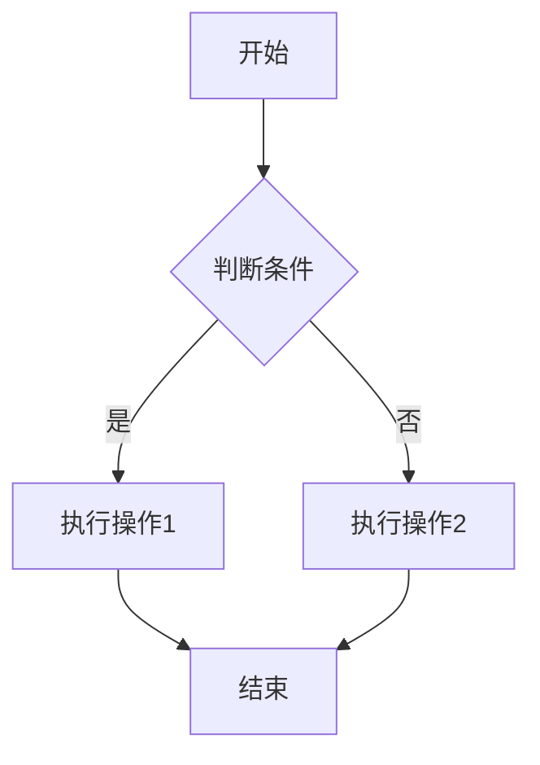
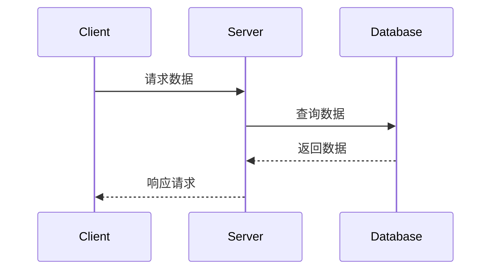
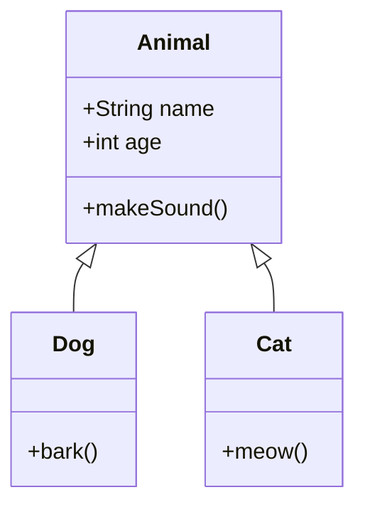
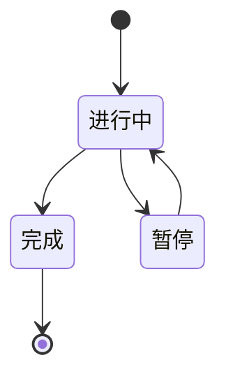
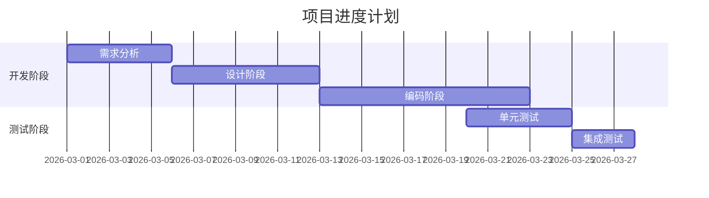

# Markdown测试文档

这是一个用于测试Markdown、Mermaid图表和LaTeX数学公式的示例文章。

## 1. 基础Markdown语法

### 标题
# 一级标题
## 二级标题
### 三级标题

### 文本格式
- **粗体文本**
- *斜体文本*
- ***粗斜体文本***
- ~~删除线文本~~

### 列表
#### 无序列表
- 项目一
- 项目二
  - 子项目1
  - 子项目2
- 项目三

#### 有序列表
1. 第一步
2. 第二步
3. 第三步

### 引用
> 这是一个引用块
> 可以包含多行内容

### 链接和图片
- [Google](https://www.google.com)
- [GitHub](https://github.com)

### 表格
| 列1 | 列2 | 列3 |
|-----|-----|-----|
| 数据1 | 数据2 | 数据3 |
| 数据4 | 数据5 | 数据6 |

### 代码块
```python
def hello_world():
    print("Hello, World!")
    return True
```

```javascript
const greeting = "Hello, World!";
console.log(greeting);
```

## 2. Mermaid图表测试

### 流程图


### 序列图


### 类图


### 状态图


### 甘特图


## 3. LaTeX数学公式测试

### 行内公式
这是一个行内公式示例：$E = mc^2$，这是爱因斯坦的质能方程。

另一个例子：$a^2 + b^2 = c^2$ 是勾股定理。

### 块级公式

#### 二次方程求根公式
$$x = \frac{-b \pm \sqrt{b^2 - 4ac}}{2a}$$

#### 定积分
$$\int_{0}^{\infty} e^{-x^2} dx = \frac{\sqrt{\pi}}{2}$$

#### 傅里叶变换
$$\mathcal{F}\{f(x)\}(\xi) = \int_{-\infty}^{\infty} f(x) e^{-2\pi i x \xi} dx$$

#### 矩阵运算
$$
\begin{bmatrix}
1 & 2 & 3 \\
4 & 5 & 6 \\
7 & 8 & 9
\end{bmatrix}
\times
\begin{bmatrix}
a \\
b \\
c
\end{bmatrix}
=
\begin{bmatrix}
a + 2b + 3c \\
4a + 5b + 6c \\
7a + 8b + 9c
\end{bmatrix}
$$

#### 求和公式
$$\sum_{n=1}^{\infty} \frac{1}{n^2} = \frac{\pi^2}{6}$$

#### 欧拉公式
$$e^{ix} = \cos x + i \sin x$$

#### 偏微分方程
$$\frac{\partial u}{\partial t} = \alpha \frac{\partial^2 u}{\partial x^2}$$

### 复杂公式

#### 麦克斯韦方程组
$$
\begin{aligned}
\nabla \cdot \mathbf{E} &= \frac{\rho}{\varepsilon_0} \\
\nabla \cdot \mathbf{B} &= 0 \\
\nabla \times \mathbf{E} &= -\frac{\partial \mathbf{B}}{\partial t} \\
\nabla \times \mathbf{B} &= \mu_0 \mathbf{J} + \mu_0 \varepsilon_0 \frac{\partial \mathbf{E}}{\partial t}
\end{aligned}
$$

#### 波尔兹曼分布
$$P(i) = \frac{e^{-E_i / k_B T}}{\sum_j e^{-E_j / k_B T}}$$

## 4. 混合使用

这是一个包含代码、公式和图表的综合示例：

### 代码中的数学公式
```python
# 计算圆的面积
import math

radius = 5
area = math.pi * radius ** 2  # A = πr²
print(f"圆的面积是: {area:.2f}")
```

### 流程图 + 公式


$$A = \pi r^2$$

## 5. 表格中的公式

| 公式名称 | 公式 | 说明 |
|---------|------|------|
| 勾股定理 | $a^2 + b^2 = c^2$ | 直角三角形三边关系 |
| 质能方程 | $E = mc^2$ | 质量与能量转换 |
| 牛顿第二定律 | $F = ma$ | 力与加速度关系 |

## 6. 代码语法高亮测试

### Python 完整示例
```python
import math
import random
 
class NeuralNetwork:
    def __init__(self, input_size, hidden_size, output_size):
        # 初始化权重（随机值在 -0.5 到 0.5 之间）
        self.weights_input_hidden = [[random.uniform(-0.5, 0.5) for _ in range(hidden_size)] for _ in range(input_size)]
        self.weights_hidden_output = [[random.uniform(-0.5, 0.5) for _ in range(output_size)] for _ in range(hidden_size)]
        
        # 初始化偏置
        self.bias_hidden = [0.0 for _ in range(hidden_size)]
        self.bias_output = [0.0 for _ in range(output_size)]
        
        # 学习率
        self.learning_rate = 0.1
    
    def sigmoid(self, x):
        return 1 / (1 + math.exp(-x))
    
    def sigmoid_derivative(self, x):
        return x * (1 - x)
    
    def forward(self, X):
        # 输入层 → 隐藏层
        self.hidden_input = [0.0 for _ in range(len(self.bias_hidden))]
        for h in range(len(self.hidden_input)):
            sum_hidden = 0.0
            for i in range(len(X)):
                sum_hidden += X[i] * self.weights_input_hidden[i][h]
            self.hidden_input[h] = sum_hidden + self.bias_hidden[h]
        
        # 隐藏层激活
        self.hidden_output = [self.sigmoid(x) for x in self.hidden_input]
        
        # 隐藏层 → 输出层
        self.output_input = [0.0 for _ in range(len(self.bias_output))]
        for o in range(len(self.output_input)):
            sum_output = 0.0
            for h in range(len(self.hidden_output)):
                sum_output += self.hidden_output[h] * self.weights_hidden_output[h][o]
            self.output_input[o] = sum_output + self.bias_output[o]
        
        # 输出层激活
        self.predicted_output = [self.sigmoid(x) for x in self.output_input]
        return self.predicted_output
    
    def backward(self, X, y, output):
        # 计算输出层误差
        output_error = [y[o] - output[o] for o in range(len(output))]
        output_delta = [output_error[o] * self.sigmoid_derivative(output[o]) for o in range(len(output))]
        
        # 计算隐藏层误差
        hidden_error = [0.0 for _ in range(len(self.hidden_output))]
        for h in range(len(self.hidden_output)):
            error = 0.0
            for o in range(len(output_delta)):
                error += output_delta[o] * self.weights_hidden_output[h][o]
            hidden_error[h] = error
        hidden_delta = [hidden_error[h] * self.sigmoid_derivative(self.hidden_output[h]) for h in range(len(self.hidden_output))]
        
        # 更新隐藏层 → 输出层权重
        for h in range(len(self.hidden_output)):
            for o in range(len(output_delta)):
                self.weights_hidden_output[h][o] += self.learning_rate * output_delta[o] * self.hidden_output[h]
        
        # 更新输出层偏置
        for o in range(len(output_delta)):
            self.bias_output[o] += self.learning_rate * output_delta[o]
        
        # 更新输入层 → 隐藏层权重
        for i in range(len(X)):
            for h in range(len(hidden_delta)):
                self.weights_input_hidden[i][h] += self.learning_rate * hidden_delta[h] * X[i]
        
        # 更新隐藏层偏置
        for h in range(len(hidden_delta)):
            self.bias_hidden[h] += self.learning_rate * hidden_delta[h]
    
    def train(self, X, y, epochs=10000):
        for epoch in range(epochs):
            # 遍历所有训练样本
            for i in range(len(X)):
                input_data = X[i]
                target = y[i]
                
                # 前向传播
                output = self.forward(input_data)
                
                # 反向传播
                self.backward(input_data, target, output)
            
            # 每 1000 次打印一次损失
            if epoch % 1000 == 0:
                loss = sum((y[i][0] - self.forward(X[i])[0]) ** 2 for i in range(len(X))) / len(X)
                print(f"Epoch {epoch}, Loss: {loss:.4f}")
    
    def predict(self, X):
        output = self.forward(X)
        return [round(output[0])]  
 
# XOR 训练数据
X = [[0, 0], [0, 1], [1, 0], [1, 1]]
y = [[0], [1], [1], [0]]
 
# 创建并训练神经网络
nn = NeuralNetwork(input_size=2, hidden_size=2, output_size=1)
nn.train(X, y, epochs=50000)
 
# 测试
print("\nPredictions:")
for x in X:
    pred = nn.predict(x)
    print(f"Input: {x}, Output: {pred[0]}")
```
---
