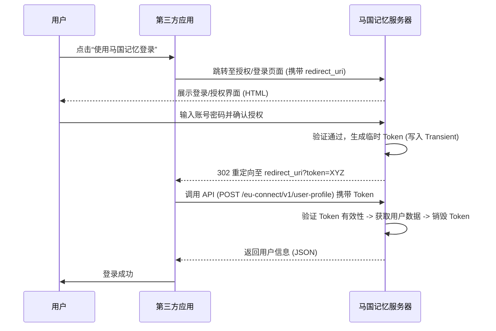

# 马国记忆 开放平台接入文档

## 1. 简介

马国记忆 开放平台允许第三方应用通过 OAuth 授权机制，安全地获取用户的基本信息（昵称、头像、UID），从而实现“一键登录”功能。

本平台采用简化版的 OAuth 流程(为什么用简化的？因为我没你那么聪明喵，复杂的还没开发出来喵，你压力我也没用喵，我只会只会划手手喵，只能让你先用简化版的喵，谢谢支持喵)，通过一次性 Token (One-Time Token) 交换用户信息，确保账号安全性。

## 2. 交互流程

1. **引导登录**：第三方应用将用户引导至马国记忆的授权页面。
2. **用户授权**：用户在马国记忆页面登录并确认授权。
3. **获取 Token**：授权成功后，浏览器跳转回第三方应用的回调地址 (`redirect_uri`)，并携带临时 `token`。
4. **换取信息**：第三方应用后端使用该 `token` 调用 API，换取用户详细信息。

> **注意**：`token` 为一次性令牌，验证一次后即刻销毁，请在获取后立即使用。



## 3. 接口规范

### 3.1 获取用户信息

使用临时 Token 换取用户基础资料。

- **接口地址**: `https://eqmemory.cn/eu-json/eu-connect/v1/user-profile`
- **请求方式**: `POST` (推荐) 或 `GET`
- **Content-Type**: `application/json`

#### 请求参数

| 参数名 | 类型 | 必填 | 说明 |
| :--- | :--- | :--- | :--- |
| `token` | String | 是 | 登录回调 URL 中获取的临时令牌 |

#### 请求示例 (CURL)

```bash
curl -X POST "https://eqmemory.cn/eu-json/eu-connect/v1/user-profile" \
     -H "Content-Type: application/json" \
     -d '{"token": "YOUR_ACCESS_TOKEN"}'
```

### 3.2 响应说明

接口返回标准的 JSON 数据。

#### 成功响应 (200 OK)

```json
{
  "id": 12345,
  "nickname": "PixelArtist",
  "avatar": "https://eqmemory.cn/path/to/avatar.jpg"
}
```

| 字段 | 类型 | 说明 |
| :--- | :--- | :--- |
| id | Integer | 用户在马国记忆平台的唯一 UID |
| nickname | String | 用户显示名称 |
| avatar | String | 用户头像 URL (优先返回自定义头像，无则返回默认) |

#### 错误响应

- **400 Bad Request**：Token 参数缺失。
  ```json
  { "error": "missing_token" }
  ```

- **401 Unauthorized**：Token 无效、已过期或已被使用（Token 仅能使用一次）。
  ```json
  { "error": "invalid_token" }
  ```

- **404 Not Found**：Token 有效，但对应的用户 ID 不存在。
  ```json
  { "error": "user_not_found" }
  ```

## 4. 接入示例代码 (PHP)

以下是一个简单的 PHP 客户端接入示例：

```php
<?php
// 假设这是您的回调处理页面 (callback.php)

$token = $_GET['token'] ?? '';
$api_endpoint = 'https://eqmemory.cn/eu-json/eu-connect/v1/user-profile';

if (empty($token)) {
    die("错误：未接收到 Token");
}

// 准备请求
$args = [
    'body'    => json_encode(['token' => $token]),
    'headers' => ['Content-Type' => 'application/json'],
    'timeout' => 15
];

// 发起请求 (这里使用 EUFrame_v1 的 HTTP API，原生 PHP 可用 curl)
// $response = v4_remote_post($api_endpoint, $args);  
// 原生 PHP 示例:
$ch = curl_init($api_endpoint);
curl_setopt($ch, CURLOPT_POST, 1);
curl_setopt($ch, CURLOPT_POSTFIELDS, $args['body']);
curl_setopt($ch, CURLOPT_HTTPHEADER, ['Content-Type: application/json']);
curl_setopt($ch, CURLOPT_RETURNTRANSFER, true);
$result = curl_exec($ch);
$http_code = curl_getinfo($ch, CURLINFO_HTTP_CODE);
curl_close($ch);

// 处理结果
if ($http_code === 200) {
    $user_data = json_decode($result, true);
    
    // 登录成功
    echo "欢迎回来，" . htmlspecialchars($user_data['nickname']);
    echo "<br>UID: " . $user_data['id'];
    echo "<br>";
    
    // TODO: 在此处执行您应用的登录/注册逻辑
    
} else {
    // 登录失败
    $error_data = json_decode($result, true);
    echo "登录失败: " . ($error_data['error'] ?? '未知错误');
}
?>
```

## 5. 常见问题 (FAQ)

Q: 为什么提示 invalid_token？
A: Token 是一次性的，出于安全考虑，验证完成后服务端会立即销毁该 Token。请检查您的代码是否在请求前重复使用了 Token，或者浏览器是否触发了页面刷新导致二次请求。

Q: 头像显示不正确？
A: 接口会优先读取 EUFrame 框架的 custom_avatar 字段。如果用户未设置自定义头像，将回退到系统默认头像。